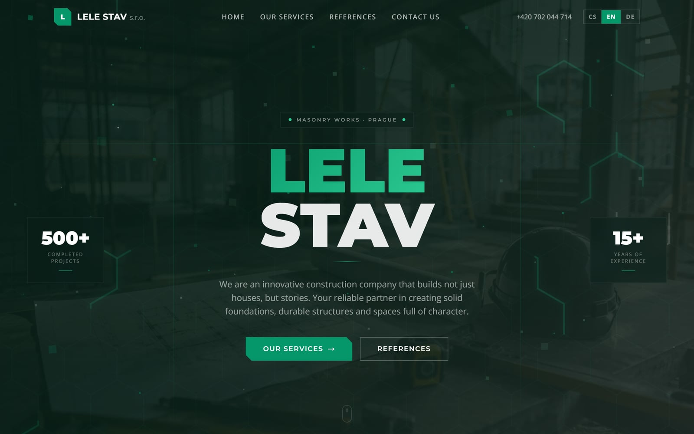
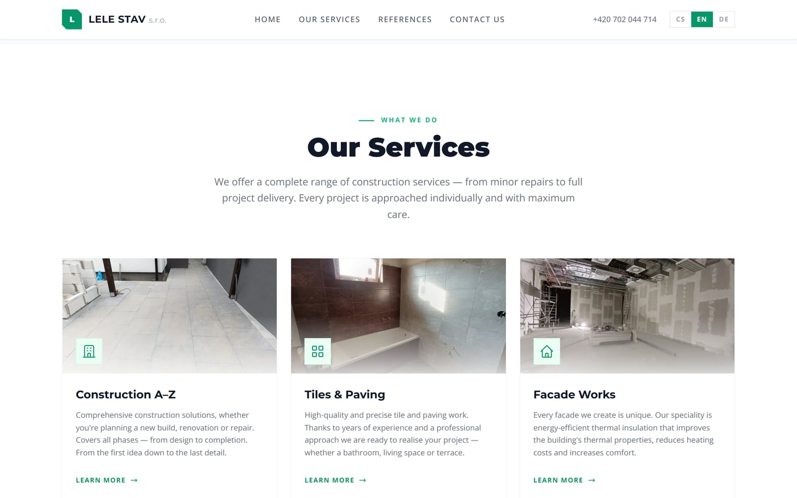
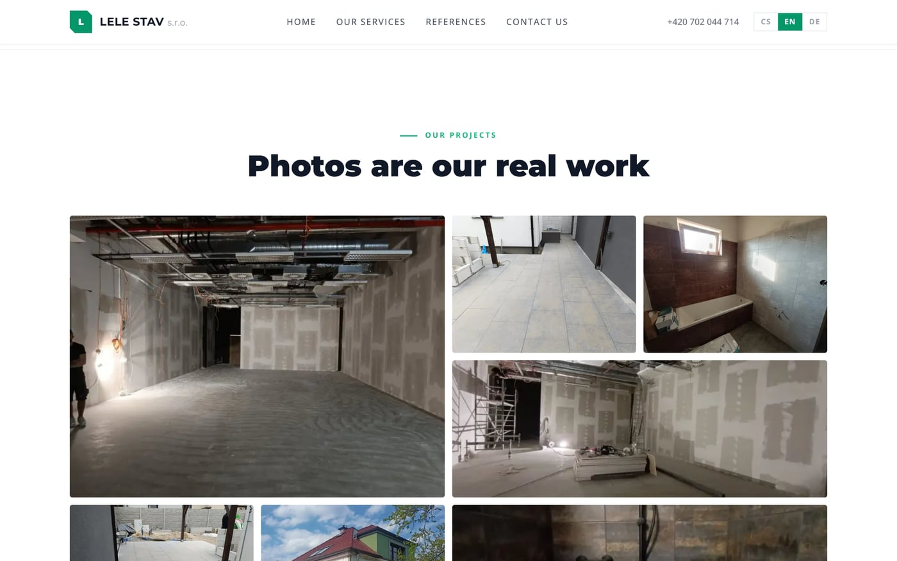
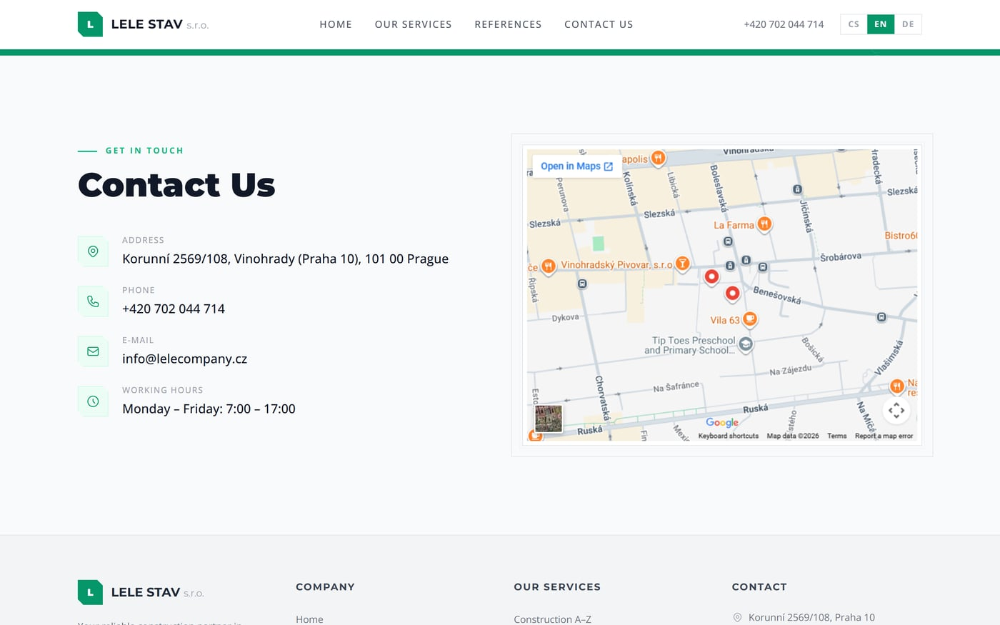
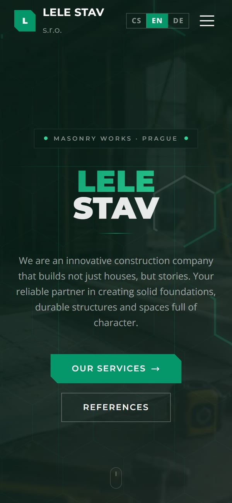

# LELE STAV - trilingual marketing site for a Prague masonry firm

A fully localized (Czech / English / German) marketing website for **LELE And Company s.r.o.**, a masonry & construction company in Prague - with a hand-built animated hero, a 100-photo lightbox gallery, and animations engineered to never cost you a smooth scroll.

**[Live demo → lele-stav.vercel.app](https://lele-stav.vercel.app/)**


> **3 languages** from one URL · **100 WebP** project photos · **0 UI libraries** - every animation and layout is hand-built.

> **My role.** Solo project delivered for a real client (a Prague masonry &
> construction firm), built by me with an AI coding agent - I owned the
> trilingual i18n setup, the hand-built animated hero, the performance
> budget, and every engineering decision throughout.



---

## Highlights

- **Trilingual from a single URL** - Czech, English, and German via `next-intl` with cookie-based locale switching (`localePrefix: 'never'`), so there are no `/en/` path prefixes to fragment SEO or break shared links.
- **A hand-built animated hero** - an SVG honeycomb grid with glowing path "travelers", floating particles, and rising embers, all written from scratch on `requestAnimationFrame` - no animation library driving the canvas.
- **Animations that yield to the scroll** - every ambient effect pauses itself the moment it leaves the viewport, so the expensive drop-shadow repaints never compete with scrolling further down the page.
- **A 100-photo gallery that stays fast** - masonry grid with a lightbox, every image lazy-loaded and responsively sized through `next/image`, served as WebP only.
- **Respects the user** - honors `prefers-reduced-motion` (the hero renders static), and ships a dedicated mobile navigation and fluid layouts down to small screens.
- **No UI kit** - no component library; every section, the marquee, the lightbox, and the count-up stats are built directly on React + Tailwind.

---

## What it is

A conversion-focused single-page marketing site: an animated hero, company stats, services, a "why us" section, a large project photo gallery, and a contact section - each localized into three languages and revealed with scroll-triggered motion. The whole experience is built by hand on Next.js App Router with no design system dependency, so the visual identity and the performance budget are both fully under control.

---

## Screenshots

| Services | Gallery |
| --- | --- |
|  |  |

| Contact | Mobile |
| --- | --- |
|  |  |

---

## Key decisions

- **Cookie-based locale over path-prefixed routing.** `next-intl` is configured with `localePrefix: 'never'`, so all three languages share one canonical URL and the locale lives in a cookie. One clean set of links to share, no duplicated URL surface - the trade-off (no per-language deep links) is the right one for a single-page brochure site.
- **The hero is raw `requestAnimationFrame`, not a library.** The glowing travelers animate `stroke-dashoffset` along SVG paths inside a single rAF loop. Hand-rolling it keeps the bundle lean and gives frame-level control over spawning and cleanup that a generic animation library wouldn't.
- **Every ambient animation is viewport-gated.** The hero's rAF loop is driven by an `IntersectionObserver` that stops it the instant the hero scrolls off; the floating particles and rising embers only mount their children while `useInView` is true. Off-screen work - especially `drop-shadow` repaints - is the enemy of a smooth scroll, so none of it runs off-screen.
- **Framer Motion only for scroll reveals.** The declarative `whileInView` reveals and count-up stats use Framer Motion; the performance-critical hero canvas deliberately does not. Right tool per job instead of one tool for everything.
- **WebP-only, `next/image` everywhere.** All 100 project photos are WebP, lazy-loaded, and given explicit responsive `sizes` so the browser never fetches a desktop-resolution image for a phone.
- **`prefers-reduced-motion` is a first-class path.** When the user asks for reduced motion, the hero skips the rAF loop entirely and renders in its final static state - accessibility handled at the source, not bolted on.

---

## Tech Stack

| Layer | Tech |
|---|---|
| Framework | Next.js 15 (App Router) + React 18 + TypeScript 5 |
| Styling | Tailwind CSS 3.4 (no component library) |
| Animation | Framer Motion 11 (scroll reveals) + hand-written `requestAnimationFrame` (hero) |
| i18n | `next-intl` 4 - cs / en / de, cookie-based, `localePrefix: 'never'` |
| Images | `next/image` (lazy, responsive `sizes`, WebP) |
| Hosting | Vercel |

---

## Getting Started

```bash
npm install
npm run dev       # development server at http://localhost:3000
```

```bash
npm run build     # production build
npm start         # serve the production build
```

---

## Project Structure

```
src/
├── app/[locale]/       # localized routes: home, /services, /gallery, /contact
├── components/         # Hero, HoneycombGrid, Gallery, Marquee, Stats, Header, Footer, ...
├── i18n/               # next-intl routing (routing.ts) & request config (request.ts)
messages/               # cs.json / en.json / de.json translations
public/images/          # 100 project photos (WebP)
```

---

## Known limitations

- **A single locale per URL.** Because locale lives in a cookie rather than the path, the three languages can't be deep-linked separately and don't get distinct URLs for SEO - an intentional trade-off for a one-page brochure site, but the wrong one for content-heavy multilingual sites.
- **Gallery images are a static bundle.** The 100 photos are committed to the repo and served from Vercel's CDN; there's no CMS or upload flow, so refreshing the gallery is a code change. Fine at this scale, not a client self-service tool.
- **Contact section is presentational.** The form/contact details are front-end only; wiring submissions to an email/CRM backend is the next step for a live lead-gen deployment.
